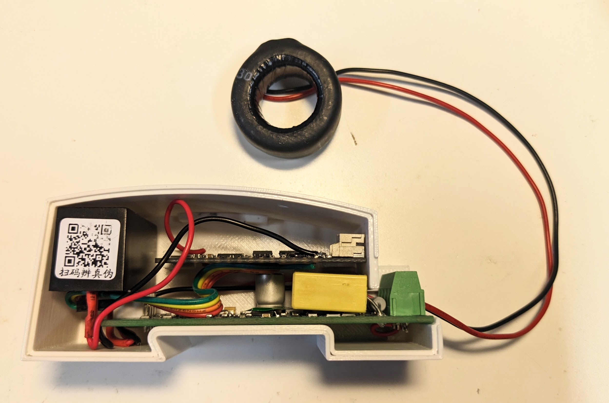

# pzem-pm-for-ha
Instuctions for assembly of a power monitor device and integrating it with the Home Assistant

## Intro

## BOM

| Component | Part name | Estimated Price (€) |
| --- | --- | --- |
| PZEM |  PZEM-004T | 6 |
| ESP32 | LOLIN32 | 3 |
| 3V power supply|Hi Link HLK-2M03 | 1.8 |

## Assembly
Please do not attmept this if you are not comfortable with high voltage.  In many countries even attaching this thing to anying live requires a certified electrician.

3D print the enclosure and the lid, find stl files in the CAD folder.

## Configuration and integration
Initialize the device as normal in ESPHome, then paste the following configuration.  Mind the secrets.
https://github.com/anverx/pzem-pm-for-ha/blob/8432b941a5b6da3bcee31511ecdca133065c0c4d/power_monitor.yaml#L1-L6

For further discussion see https://community.home-assistant.io/t/how-to-use-pzem004t-energy-monitor-with-esphome/107083

## Ideas

I wanted to make the enclosure DIN rail mountable, so it has a goove in the bottom for the rail, but never got around to modeling the clip.
Another thing that's missing is cover for the terminals.  Is seems to be a common safety feature nowadays 
